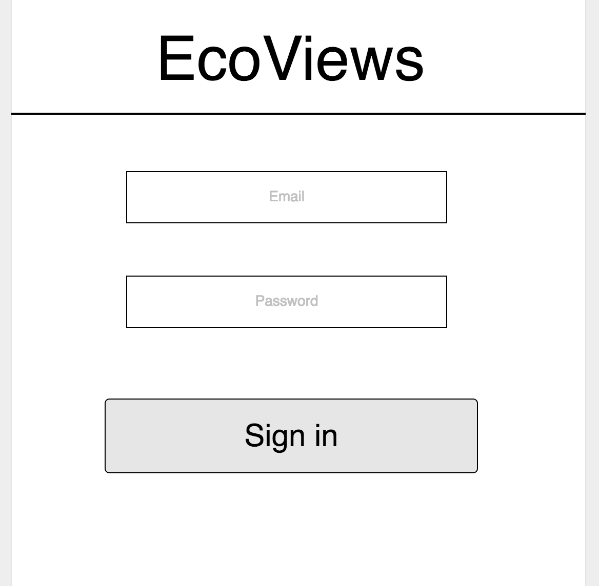

Unit #4 Project

                       
                    /////////////////////////////
                    //       About
                    /////////////////////////////

    A user can click from a list of seeded sectors. Depending on chosen sector, user will only have ability to pick an  industry that is predefined to match the parent sector.

    EcoRev is an app built for consumers to educate themselves and spread awareness throughout their communities about the origin and production process of their purchases to make more informed decisions and reduce their impact on the planet and all species. 

    ### General Approach 

Three models: User, Product and SectorIndustry

User can CRUD product data

                    Relationships:

        
        User has many product reviews. 
        A product has one sector and one industry.

    ### Technologies Used

    For server side:
        -JavaScript
        -Mongodb
        -Node
        -Express

    For client side:
        -HTML
        -CSS
        -Angular
        -Bower

    ### Unsolved problems 

    -Have not completed user CRUD functionality

    -Have not completed the update or delete functionality.

    -Have not implemented auth.

    -Have not gotten image urls to display image on the page.

    -Incomplete styling

    -Have not implemented data visualizations

    

/////////////////////////////
//      User Stories
/////////////////////////////

https://trello.com/b/31kST3qY/project-4

/////////////////////////////
//      Wireframes
/////////////////////////////

<h2>Home</h2> 
<h2>About</h2> 
<h2>Sign Up</h2> 
<h2>Login</h2> 
<h2>New product</h2> 
<h2>All products</h2> 
<h2>One product</h2> 
<h2>Delete product</h2> 
/////////////////////////////
//      Pitch Deck
/////////////////////////////

/////////////////////////////
//      Workflow
/////////////////////////////

-Create client directory for front end.

    -Create public directory and touch index.html (this is the homepage)

            -Create a scripts directory and touch app.js.
            
            -Create a styles directory and touch styles.css. Here you will add custom styling to your pages.      
                -Create images directory to store app's images
            
           -Create templates directory and touch files needed for all views (productIndex.html, productShow.html, profile.html, about.html productNew.html, productUpdate.html, signUp.html, login.html)
    
 -Install technologies needed in public directory (Angular, Bower, Bootstrap and Passport) 

-Include bootstrap, styles.css, angular/bower and app.js in index.hmtl 

-Create server directory.
-Install Node, Express and Mongo

    -Add 'node_modules' to .gitignore file.
    -Create models directory. 
        -Touch index.js, product.js and user.js
    -Create routes directory.
        -Touch routes.js

-Touch server.js and require mongoose.
    -Require and use express.
    -Require and use body parser.
    -Requrie mongoose.
    -Require models.
    -Create empty array for products. 
    -Create HTML endpoint for homepage.
    -Create API routes.
    -Create JSON endpoints to get all products, get one product by id, create a product, edit a product and delete a product.
    -Set up server to listen on port 3000.

-Touch seed.js. 
    -Require models in db variable. 
    -Include seeded data array for products.

Install Bower for front-end dependencies 
    
    Use 'npm install -g bower'. 
    Bower enables local file installation. 
    
    Initialize with 'bower init' to generate bower.json file. 
    This will provide a way to share code without sending third-party libraries.

    Use'bower install --save angular' to pull down Angular.

    Link index.html to Angular with '' above app.js's script link

Use NPM to require Express:
    
    Initialize node in directory with 'npm init -y'.
    Install express with 'npm install --save express'.
    Package.json will track project associated dependencies and metadata.
    
    Add 'node_modules' to .gitignore file so it is not tracked by git.

Require Mongoose in server.js

Install body parser and mongoose
    'npm install mongoose --save'

Use directives ngApp, ngView, ngModel,  ngController and ngRepeat

